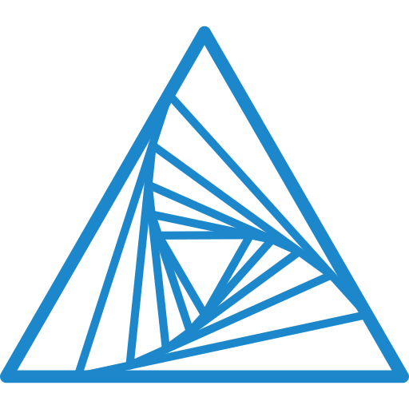

  

# Schulprojekt: ClockTrack

## Projektbeschreibung

Für mein Projekt entwickle ich einen Tracker für meine wöchentlichen Spielrunden des Spiels Blood on the Clocktower, die ich selbst als Spielleiter (Storyteller) betreue.

Die Anwendung verwaltet Spieler, Sitzungen und die jeweiligen Rollenzuweisungen pro Sitzung, inklusive Informationen wie
Team-Zugehörigkeit, Todestag und Todesursache innerhalb einer Partie. Zusätzlich wird das verwendete Skript (Script) zu
jeder Sitzung hinterlegen. Die Daten stammen aus echten, bereits gespielten Runden meiner eigenen Gruppe. Als
Zusatzfunktion plane ich eine Statistik-Auswertung, zum Beispiel Gewinnraten nach Team oder die am häufigsten gespielten
Rollen pro Spieler.

Die Datenbank besteht aus vier Tabellen mit mehreren Fremdschlüsselbeziehungen sowie einer zusammengesetzten Eindeutigkeits-Constraint zwischen Sitzung und Spieler.

Als User Interface habe ich eine grafische Anwendung mit JavaFX umgesetzt. Das Hauptfenster hat drei Tabs zum Verwalten
von Sitzungen, Spielern und Skripten. Jeder Tab zeigt eine Tabelle mit Schaltflächen zum Anlegen, Bearbeiten und
Löschen. Beim Bearbeiten einer Sitzung öffnet sich ein eigener Tab, in dem auch die teilnehmenden Spieler mit ihren
Rollen gepflegt werden.

